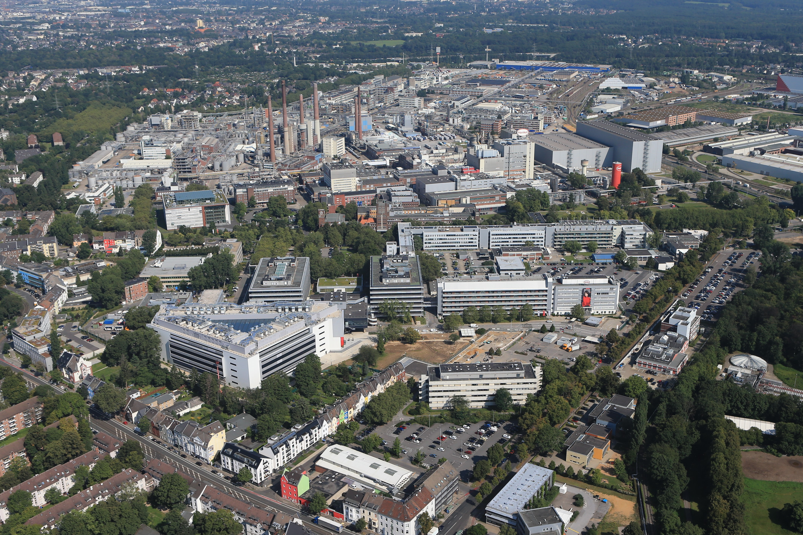
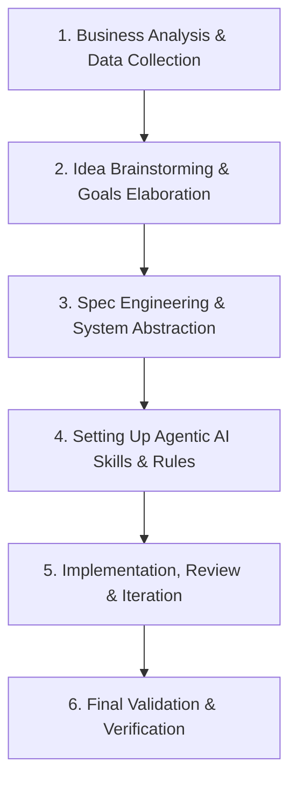

# RIZM Energy OS Minimum Viable Product (MVP) — Henkel Düsseldorf Holthausen Pilot

<div style="width: 100%; height: 350px; overflow: hidden; border-radius: 8px;">
  
</div>

---

## 1. Introduction & Overview

Welcome to the **RIZM Energy OS** MVP attempt pilot repository for **Henkel’s flagship chemical and consumer goods manufacturing site in Düsseldorf-Holthausen**. 

This repository provides an open-source, production-grade, sector-coupled energy optimization engine and decision framework built using **PyPSA** (Python for Power System Analysis) and **HiGHS** linear programming solver. It models the site's dual-temperature thermal hierarchy (High-Temperature 16 bar steam vs. Mid-Temperature 80 °C process heat) and continuous baseload electrical demand to evaluate decarbonization and cost-reduction strategies measured directly in energy cost **€ / ton of industrial output**.

---

## 2. Modeling Approach & Extent of Abstraction

### Why This Approach?
This solution is grounded in a personal background expertise in **Mixed-Integer Linear Programming (MILP) and Linear Programming (LP) energy optimization** paired with a passion for **software framework architecture and system design**. 

### Why This Level of Abstraction?
- **Modular OOP Architecture:** An Object-Oriented Programming (OOP) design pattern was adopted for the energy system components (`src/components/`). This decouples component physics, financial logic, and PyPSA graph construction from the core solver loop, ensuring the framework is modular and extensible for simulating diverse industrial case studies or energy assets.
- **Pragmatic MVP Scoping:** The framework was intentionally kept at a clean Minimum Viable Product (MVP) boundary. This balances engineering quality, mathematical rigor, and software abstraction while managing time and priorities during my final stages of writing a **Master's thesis report**.

---

## 3. Challenge Execution Process

The development of this decision framework followed a disciplined 6-step engineering methodology:



### Process Step Details & Significance

1. **Business Analysis & Data Collection**
   *Understand the line of business, energy consumption scale, and baseline magnitude (60 MW electrical, 220 MW thermal baseload across 450,000 tons/yr output).*
2. **Idea Brainstorming & Goals Elaboration**
   *Land on an impactful, mathematically sound solution with clear metrics (€/ton production cost reduction).*
3. **Spec Engineering & System Abstraction Creation**
   *Utilize Spec-Driven Development to establish a clear single source of truth (`SPEC.md`) for working with agentic AI models. Apply system design principles to build modular OOP abstractions while avoiding over-engineering for the MVP scope.*
4. **Setting Up Skills, Rules, and Loops for Agentic AI**
   *Equip the AI assistant with specialized domain skills (PyPSA skills, MILP modeling standards, German energy market regulations, and Python best practices) to ensure grounded reasoning and self-correcting validation.*
5. **Implementation, Review, Iteration**
   *Execute phase-based tasks defined in the specification sheet. Perform continuous review, code audits, and refactoring iterations to maintain clean architecture and code clarity. *
6. **Final Validation**
   *Rigorously test the logical accuracy, mathematical calculation, solver convergence, and business alignment of all challenge deliverables.*

   >The framework had taken a steep u-turn from a previously adopted oemof-solph based framework (my native tool) to PyPSA due to performance and ease of use (oemof-solph requires a solver installation to path that can become tricky for non-technical user

---

## 4. Executive Teaser: Key Results

The optimization framework evaluates three core operational and investment scenarios:

| Scenario / Hub | Total Annual Cost (€) | Cost per Ton (€/ton) | Key Driver |
|----------------|------------------------|----------------------|------------|
| **Baseline (Current Site Heuristic)** | **€171,483,911** | **€381.08 / ton** | Gas boilers & grid import under §19 StromNEV privilege |
| **Operation Hub (Dispatch Opt.)** | **€170,818,800** | **€379.60 / ton** | Optimized hourly dispatch & spot market arbitrage |
| **Decision Hub (CAPEX Co-Opt.)** | **€154,313,400** | **€342.92 / ton** | HTHP, E-boiler, Solar PV & Offsite PPA expansion |

> **Full Results & Interactive Visualizations:** To view complete interactive dispatch stacks, State-of-Charge dynamics, and financial waterfall breakdowns, visit the notebook deliverables detailed below.

---

## 5. Reviewer Navigation Guide

Depending on how you wish to evaluate this submission, choose one of the two navigation paths:

### Option A: Quick Online Review (GitHub Pre-Rendered)
If you want to quickly inspect the challenge solution and pre-rendered plots directly on GitHub without cloning the repo:
 **Open [`challenge_static_final.ipynb`]**
*All Matplotlib dispatch stacks, asset comparison tables, and financial breakdowns are fully rendered and ready to view online.*

### Option B: Interactive Local Deep Dive (`uv`)
If you want to run the PyPSA optimization engine locally, experiment with asset capacities, or view interactive Plotly dashboards:

1. **Clone the Repository:**
   ```bash
   git clone https://github.com/rafindrajaya/RIZM_Henkel_Challenge_Rafi.git
   cd RIZM_Henkel_Challenge_Rafi
   ```

2. **Initialize Environment with `uv`:**
   This project uses [`uv`](https://github.com/astral-sh/uv) for fast, 100% reproducible environment locking.
   ```bash
   uv sync
   ```

3. **Launch Interactive Notebook (Either through uv or just simply access the notebook):**
   ```bash
   uv run jupyter notebook challenge_interactive.ipynb
   ```
   *Or run the static notebook deliverable:*
   ```bash
   uv run jupyter notebook challenge_static_final.ipynb
   ```

---

## 6. Tech Stack & Justifications

| Technology | Role | Justification |
|------------|------|---------------|
| **Python >=3.10** | Programming Language | Core ecosystem standard for scientific computing and optimization. |
| **`uv` (v0.11+)** | Package & Env Management | Fast, cross-platform dependency resolution via lockfile (`uv.lock`). |
| **`PyPSA` (>=0.28.0)** | Energy Modeling Engine | Industry-standard graph-based framework for sector-coupled energy optimization. |
| **HiGHS (`highspy` / `linopy`)** | MILP / LP Solver | High-performance, open-source linear solver integrated natively with PyPSA. |
| **`pydantic` (>=2.0.0)** | Data & Config Validation | Enforces strict schema validation for TOML component configuration files. |
| **`pvlib` (>=0.11.0)** | Solar Physics Simulation | Models Plane-of-Array irradiance and temperature-dependent PV yield curves. |
| **`plotly` & `matplotlib`** | Visualization Engines | Multi-carrier interactive HTML dispatch dashboards & static publication plots. |

---

## 7. Documentation & Architecture Details

For reviewers seeking an in-depth look at internal system contracts, bus topography, component schemas, or repo foundation:

>**Read the Single Source of Truth: [`SPEC.md`]**
