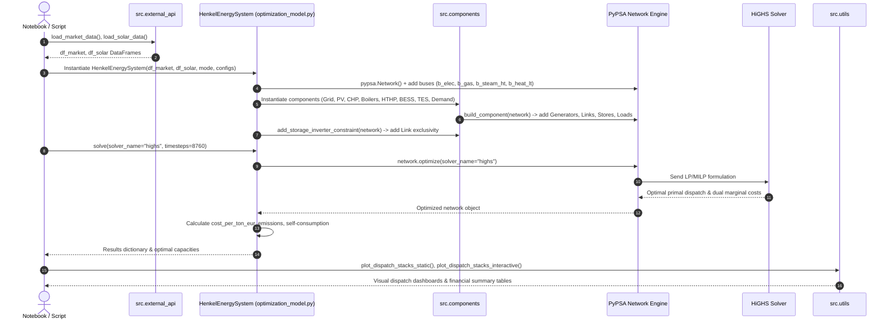

# SPEC.md -- Henkel Düsseldorf Agentic Energy OS Challenge

> Single Source of Truth for system architecture, directory structure, tech stack, data schemas, energy system design, and optimization modes.

---

## 1. Project Objective

Build a production-grade, modular, reproducible MVP repository for Henkel's flagship chemical/consumer goods manufacturing site in Düsseldorf-Holthausen.

### 1.1 Challenge Deliverables

| # | Deliverable | Description & Success Criteria |
|---|-------------|--------------------------------|
| D1 | On-Site Energy Use Cases | Identify high-value, data-driven energy business use cases measured in EUR/ton production cost reduction. |
| D2 | Primary On-Site Data Request | Formulate the single most load-bearing data request for initial site onboarding, fully justified from first principles. |
| D3 | Primary Stakeholder Alignment | Identify the single key site stakeholder required for alignment and outline a 30-minute engagement strategy. |

### 1.2 Evaluation Philosophy

- **Method over outcome:** First-principles reasoning and structural clarity over brute-force complexity.
- **Defensible assumptions:** Ground every technical, thermodynamic, and financial parameter in empirical data or literature benchmarks.
- **Toolchain transparency:** Explicitly document solver engines, component models, and data pipeline flows.

---

## 2. Tech Stack (Locked)

| Layer | Tool | Version Constraint | Role & Notes |
|-------|------|--------------------|--------------|
| Language | Python | >=3.10 | Core execution environment (via `pyproject.toml`) |
| Package & Env | `uv` | >=0.11 | Ultra-fast, cross-platform lockfile management via `uv.lock` |
| Energy Modeling | `pypsa` | >=0.28.0 | Sector-coupled energy system graph modeling engine |
| MILP/LP Solver | HiGHS via `linopy` / `highspy` | >=1.7.0 | High-performance open-source linear optimization solver |
| Data Validation | `pydantic` | >=2.0.0 | Strict configuration schemas and type validation |
| Solar Physics | `pvlib` | >=0.11.0 | Plane-of-Array irradiance & temperature-dependent solar yield |
| Data Processing | `pandas`, `numpy` | >=2.0.0, >=1.24.0 | Datetime series manipulation and matrix operations |
| Visualization | `plotly`, `matplotlib`, `seaborn` | >=5.0.0, >=3.7.0, >=0.12.0 | Static and interactive dispatch dashboards |
| External APIs | `requests` | >=2.31.0 | Automated retrieval of SMARD market prices & Open-Meteo weather data |
| Spreadsheet IO | `openpyxl` | >=3.1.0 | Excel export utilities for financial reporting |
| Execution | `jupyter` | >=1.0.0 | Interactive notebook environment |
| Build System | `setuptools` | >=61.0 | Packaging build backend |

---

## 3. Directory Structure & Architecture Diagrams

### 3.1 Canonical Directory Structure

```
RIZM_challenge_Rafi/
├── .agent/                             # Domain skills & agent instructions
│   └── skills/                         # Specialized domain knowledge rules
├── data/
│   ├── market_data_2025.csv            # Live SMARD hourly spot electricity & THE gas prices (2025, 8760h)
│   ├── solar_data_duesseldorf_2025.csv  # Open-Meteo GHI, DNI, DHI & ambient temperature (2025, 8760h)
│   └── components/                     # TOML configuration files for energy assets
│       ├── bess.toml                   # Battery Energy Storage System specs
│       ├── chp.toml                    # Combined Heat & Power unit specs
│       ├── eboiler.toml                # Electric Boiler specs
│       ├── hthp.toml                   # High-Temperature Heat Pump specs
│       ├── pv.toml                     # Solar PV specs
│       └── demand.toml                 # Baseline load profiles
├── ref/                                # Literature references & site reports
├── src/
│   ├── __init__.py
│   ├── components/                     # Modular OOP component architecture for PyPSA
│   │   ├── __init__.py                 # Component package exports
│   │   ├── base.py                     # BaseEnergyComponent abstract class & EAC annuity helper
│   │   ├── grid.py                     # Electricity grid, gas grid, grid export, & PPA generators
│   │   ├── pv.py                       # Rooftop PV generator with pvlib yield integration
│   │   ├── chp.py                      # Combined Heat & Power co-generation link
│   │   ├── boilers.py                  # Gas Boiler, Electric Boiler, Steam Heat Exchanger
│   │   ├── heat_pump.py                # High-Temperature Heat Pump link
│   │   ├── storage.py                  # BESS & TES storage components with inverter constraints
│   │   └── demand.py                   # Industrial electrical, HT steam, & MT heat loads
│   ├── external_api.py                 # SMARD market & Open-Meteo solar data pipeline
│   ├── optimization_model.py           # PyPSA HenkelEnergySystem network model & Pydantic schemas
│   └── utils.py                        # Visual dispatch stacks, financial metrics, & schematic plots
├── tests/
│   └── test_static_1week_plotting.py   # Unit test suite for static 1-week dispatch visualization
├── docs/
│   ├── progress_update/                # Progress reports tracking refactoring & audits
│   ├── challenge_question.md           # Original RIZM challenge brief
│   ├── notes_new.md                    # System modeling notes
│   └── checklist.md                    # Submission verification checklist
├── challenge_interactive.ipynb         # Notebook deliverable (interactive Plotly dashboards)
├── challenge_static_final.ipynb        # Final static notebook deliverable
├── pyproject.toml                      # Project dependencies & metadata
├── uv.lock                             # Universal lockfile for exact environment reproducibility
├── README.md                           # Main repository guide
└── SPEC.md                             # THIS FILE -- Single source of truth
```

### 3.2 OOP Component Architecture (Mermaid Class Diagram)

```mermaid
classDiagram
    class BaseComponentConfig {
        +str name
        +bool is_extendable
        +int lifetime_years
    }
    
    class BaseEnergyComponent {
        <<abstract>>
        +str name
        +BaseModel config
        +bool is_extendable
        +calculate_annualized_capex(wacc) float
        +get_capital_cost(wacc) float
        +build_component(network, wacc)*
    }
    
    BaseEnergyComponent <|-- GridElectricityComponent
    BaseEnergyComponent <|-- GridGasComponent
    BaseEnergyComponent <|-- GridExportComponent
    BaseEnergyComponent <|-- PVPPAComponent
    BaseEnergyComponent <|-- WindPPAComponent
    BaseEnergyComponent <|-- PVComponent
    BaseEnergyComponent <|-- GasCHPComponent
    BaseEnergyComponent <|-- GasBoilerComponent
    BaseEnergyComponent <|-- EBoilerComponent
    BaseEnergyComponent <|-- SteamHeatExchangerComponent
    BaseEnergyComponent <|-- HTHPComponent
    BaseEnergyComponent <|-- BESSComponent
    BaseEnergyComponent <|-- TESComponent
    BaseEnergyComponent <|-- DemandComponent
    
    BaseComponentConfig <|-- GridElectricityConfig
    BaseComponentConfig <|-- GridGasConfig
    BaseComponentConfig <|-- GridExportConfig
    BaseComponentConfig <|-- PVPPAConfig
    BaseComponentConfig <|-- WindPPAConfig
    BaseComponentConfig <|-- PVComponentConfig
    BaseComponentConfig <|-- CHPComponentConfig
    BaseComponentConfig <|-- GasBoilerConfig
    BaseComponentConfig <|-- EBoilerConfig
    BaseComponentConfig <|-- SteamHeatExchangerConfig
    BaseComponentConfig <|-- HTHPComponentConfig
    BaseComponentConfig <|-- BESSComponentConfig
    BaseComponentConfig <|-- TESComponentConfig
    BaseComponentConfig <|-- DemandConfig
```



### 3.3 Optimization Execution Pipeline (Mermaid Sequence Diagram)



---

## 4. Energy System Architecture & Schemas

### 4.1 Bus Topography

| Bus Label | Bus Name | Carrier | Unit | Target Quality / Temperature |
|-----------|----------|---------|------|------------------------------|
| `b_elec` | Electricity Bus | Electricity | kW | Site electrical distribution |
| `b_gas` | Natural Gas Bus | Natural Gas | kW (LHV) | High-pressure gas grid supply |
| `b_steam_ht` | High-Temp Steam Bus | High-Temp Steam | kW_th | Process Steam (16 bar, ~200 °C) |
| `b_heat_lt` | Process Heat Bus | Mid/Low-Temp Heat | kW_th | Hot Water / Process Heat (~80 °C) |

### 4.2 Energy Assets & PyPSA Network Components

| Component | PyPSA Type | Input Bus | Output Bus(es) | Key Operational & Thermodynamic Parameters |
|-----------|------------|-----------|----------------|-------------------------------------------|
| `grid_electricity` | Generator | -- | `b_elec` | Marginal cost = hourly spot price + grid fee (€/MWh) |
| `grid_gas` | Generator | -- | `b_gas` | Marginal cost = THE gas spot + CO2 tax (€/MWh) |
| `grid_export` | Generator/Link | `b_elec` | -- | Negative generator / link for selling excess power to grid |
| `solar_pv` | Generator | -- | `b_elec` | Capacity factor profile computed via `pvlib` |
| `pv_ppa` | Generator | -- | `b_elec` | Solar PPA with fixed strike price (€/MWh) & yield profile |
| `wind_ppa` | Generator | -- | `b_elec` | Wind PPA with fixed strike price (€/MWh) & yield profile |
| `gas_chp` | Link | `b_gas` | `b_elec`, `b_steam_ht` | $\eta_{el} = 0.40$, $\eta_{th} = 0.45$ (Total $\eta = 0.85$) |
| `gas_boiler` | Link | `b_gas` | `b_steam_ht` | $\eta_{th} = 0.92$ |
| `electric_boiler` | Link | `b_elec` | `b_steam_ht` | $\eta_{th} = 0.98$ |
| `steam_to_heat_exchanger` | Link | `b_steam_ht` | `b_heat_lt` | $\eta_{th} = 0.98$ (Degrades HT steam to MT heat) |
| `heat_pump` | Link | `b_elec` | `b_heat_lt` | $\text{COP} = 2.8$ (High-temperature industrial heat pump) |
| `bess` | Store + Links | `b_elec` | `b_elec` | $\eta_{in} = 0.95$, $\eta_{out} = 0.95$ (RTE = 90%), inverter exclusivity |
| `tes` | Store | `b_heat_lt` | `b_heat_lt` | $\eta_{in} = 0.98$, $\eta_{out} = 0.98$, standing loss $= 0.005\text{ h}^{-1}$ |
| `demand_elec` | Load | `b_elec` | -- | 60 MW continuous industrial electrical baseload |
| `demand_steam` | Load | `b_steam_ht` | -- | 160 MW_th continuous high-temp steam demand |
| `demand_heat` | Load | `b_heat_lt` | -- | 60 MW_th continuous process heat demand |

### 4.3 Pydantic Configuration Schemas

The model relies on Pydantic schemas in `src/optimization_model.py` and `src/components/` to strictly enforce type correctness and parameter validation.

- **`FixedSizingConfig`**: Configures installed capacities for existing assets (`chp_el`, `chp_th`, `gas_boiler`, `eboiler`, `hthp`, `tes`, `pv`, `bess`, `grid_export`, demand overrides).
- **`InvestmentSizingConfig`**: Enables capacity co-optimization for candidate technologies (`pv`, `bess`, `hthp`, `tes`, `pv_ppa`, `wind_ppa`).
- **`FacilityProjectConfig`**: Site operational settings including annual production volume (450,000 tons/yr), WACC (7%), grid fee regimes (Standard vs. §19 StromNEV), PPA strike prices, and export caps.
- **`ComponentBounds`**: Min/max capacity limits passed to PyPSA investment optimization.

---

## 5. Optimization Modes

The PyPSA network supports two primary operational and planning modes:

### 5.1 Operation Mode (`mode="operation"`)

- **Objective:** Minimize total hourly operational expenditure (OPEX) across the simulation horizon.
- **Asset Capacities:** Fixed based on Henkel's current installed site assets (`FixedSizingConfig`).
- **Decision Variables:** Hourly dispatch rates of generators, links, stores, and grid import/export streams.
- **Use Case:** Day-ahead operational scheduling, fuel switching (gas boiler vs. electric boiler vs. CHP), spot market arbitrage, and battery charge/discharge optimization.

### 5.2 Investment Mode (`mode="investment"`)

- **Objective:** Minimize total annualized system cost ($\text{Total Cost} = \text{OPEX} + \text{Annualized CAPEX}$).
- **CAPEX Treatment:** Overnight capital expenditure is converted into Equivalent Annualized Cost (EAC) per unit of capacity using asset lifetimes and site WACC (7%):
  $$\text{EAC} = \text{CAPEX} \cdot \left[ \frac{wacc \cdot (1 + wacc)^n}{(1 + wacc)^n - 1} \right] + \text{OPEX}_{fixed}$$
- **Decision Variables:** Jointly optimizes capacity expansion ($\text{kW}$ or $\text{kWh}$) for extendable candidate assets (PV, BESS, HTHP, TES, PPAs) and their 8760h hourly dispatch.
- **Use Case:** Decarbonization roadmap planning, asset sizing, and capital allocation for site transformation.

---

## 6. Execution Phases & Refactoring Milestones

A summary of key milestones tracking the evolution of the repository:

1. **Phase 1: PyPSA Engine Migration & Base OOP Abstraction**
   - Transformed initial model concepts into a clean, modular PyPSA framework.
   - Designed `BaseEnergyComponent` abstract base class and standardized component lifecycle in `src/components/`.

2. **Phase 2: Data Pipeline & Thermodynamic Realism Audit**
   - Built automated data fetching pipelines in `src/external_api.py` for SMARD electricity/gas spot prices and Open-Meteo weather data.
   - Integrated `pvlib` for physical PV yield calculations.
   - Enforced dual-temperature thermal quality (HT 16 bar steam vs. MT 80 °C process heat) and COP modeling for industrial heat pumps.

3. **Phase 3: Grid Export, PPAs & BESS Inverter Constraint Hardening**
   - Implemented offsite Wind and PV PPA generator components with flexible strike price structures.
   - Added configurable electricity grid export limits (`grid_export`).
   - Implemented custom PyPSA extra-functionality constraints (`add_storage_inverter_constraint`) to guarantee mutually exclusive charging and discharging links for BESS.

4. **Phase 4: Reporting & Visual Dashboards Refactor**
   - Built `src/utils.py` module featuring interactive Plotly dispatch dashboards, static Matplotlib 1-week/full-horizon plots, and executive financial summary tables.
   - Standardized cost per ton metrics (`EUR/ton`) and §19 StromNEV fee savings calculations.

5. **Phase 5: Automated Testing & Verification**
